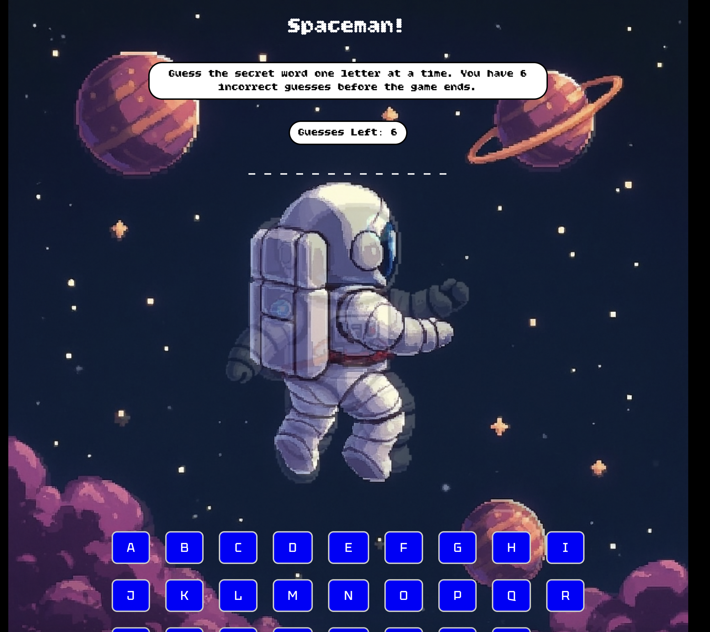

## Game name and description:
**Spaceman!**
Spaceman is a space themed word guessing game where the player unveils one letter at a time without going over the limit of 6 incorrect guesses, similar to Hangman! I chose this game because it what was I was most familiar with compared to the other games.

## Deployed Game Link: 
https://austinvanloon-beep.github.io/austins-spaceman-game/

## Attributes: 
- https://fonts.google.com/specimen/Tektur
- https://fonts.google.com/specimen/Bitcount+Grid+Double
- https://www.w3schools.com/css/default.asp
- https://developer.mozilla.org/en-US/docs/Web/CSS/background-size?utm

## Technologies used: 
- HTML
- CSS
- JS
- README

## Next steps: 
- Center last row of letters 
- Add light/dark theme 
- Guesses button lights red when incorrect guess happens